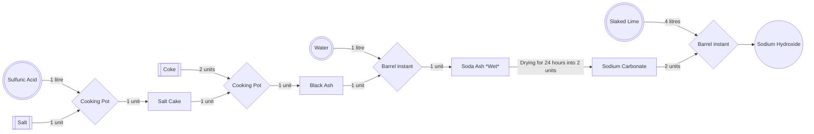
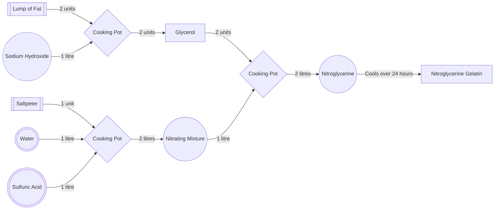
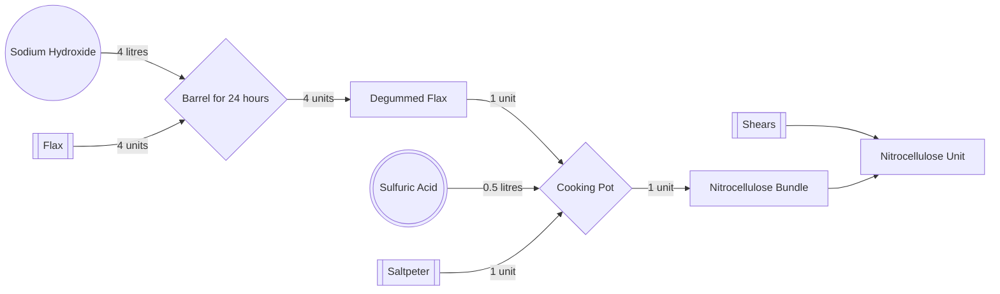
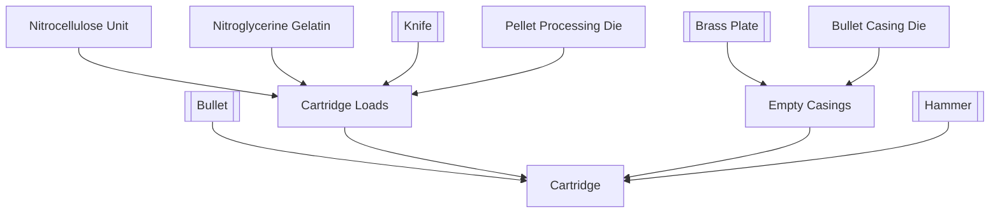

# Enhanced Firearms
A mod for the game Vintage Story.

## Making Sodium Hydroxide

```mermaid
flowchart LR

%% Existing Items
    salt[[Salt]]
    coke[[Coke]]

%% Existing Fluids
    sulfuric(((Sulfuric Acid)))
    slakedLime(((Slaked Lime)))
    water(((Water)))

%% New Fluids
    sodiumHydroxide((Sodium Hydroxide))

%% New Items
    sodiumCarb[Sodium Carbonate]
    saltCake[Salt Cake]
    blackAsh[Black Ash]
    sodaAshWet[Soda Ash *Wet*]

%% Processing
    cookSulfate{Cooking Pot}
    cookAsh{Cooking Pot}
    soakAsh{Barrel instant}
    soakCarb{Barrel instant}

%% Ratios
    sulfuric -- 1 litre --> cookSulfate
    salt-- 1 unit --> cookSulfate
    cookSulfate -- 1 unit --> saltCake


    coke -- 2 units --> cookAsh
    saltCake -- 1 unit --> cookAsh
    cookAsh -- 1 unit --> blackAsh

    water -- 1 litre --> soakAsh
    blackAsh -- 1 unit --> soakAsh
    soakAsh -- 1 unit --> sodaAshWet

    sodaAshWet -- Drying for 24 hours into 2 units--> sodiumCarb

    slakedLime -- 4 litres --> soakCarb
    sodiumCarb -- 2 units --> soakCarb
    soakCarb --> sodiumHydroxide
```

## Making Nitroglycerine

```mermaid
flowchart LR
%% Existing Items
    fat[[Lump of Fat]]
    saltpeter[[Saltpeter]]

%% Existing Fluids
    water(((Water)))
    sulfuric(((Sulfuric Acid)))
    
%% New Fluids
    sodiumHydroxide((Sodium Hydroxide))
    nitratingMix((Nitrating Mixture))
    nitroglycerine((Nitroglycerine))
    
    
%% New Items
    glycerol[Glycerol]
    nitroJelly[Nitroglycerine Gelatin]
    
%% Processing 
    cookFat{Cooking Pot}
    cookSalt{Cooking Pot}
    cookGlycerol{Cooking Pot}

%% Ratios
    fat -- 2 units --> cookFat
    sodiumHydroxide -- 1 litre --> cookFat
    cookFat -- 2 units --> glycerol
    
    saltpeter -- 1 unit --> cookSalt
    water-- 1 litre --> cookSalt
    sulfuric -- 1 litre --> cookSalt
    cookSalt -- 2 litres --> nitratingMix
    
    glycerol -- 2 units --> cookGlycerol
    nitratingMix -- 1 litre --> cookGlycerol
    cookGlycerol -- 2 litres --> nitroglycerine
    
    nitroglycerine -- Cools over 24 hours--> nitroJelly

```

## Making Nitrocellulose

```mermaid
    flowchart LR

%% Existing Items
    flax[[Flax]]
    saltpeter[[Saltpeter]]
    shears[[Shears]]

%% Existing Fluids
    sulfuric(((Sulfuric Acid)))

%% New Fluids
    sodiumHydroxide((Sodium Hydroxide))

%% New Items
    degummedFlax[Degummed Flax]
    nitroBundle[Nitrocellulose Bundle]
    nitroUnits[Nitrocellulose Unit]

%% Processing
    soakFlax{Barrel for 24 hours}
    cookFlax{Cooking Pot}

%% Ratios
    sodiumHydroxide -- 4 litres --> soakFlax
    flax -- 4 units --> soakFlax
    soakFlax -- 4 units --> degummedFlax
    
    degummedFlax -- 1 unit --> cookFlax
    sulfuric -- 0.5 litres --> cookFlax
    saltpeter -- 1 unit --> cookFlax
    cookFlax -- 1 unit --> nitroBundle

    shears --> nitroUnits
    nitroBundle --> nitroUnits
```

## Making Cartridges

```mermaid
flowchart TD

    %% Existing Items

    brassPlate[[Brass Plate]]
    hammer[[Hammer]]
    knife[[Knife]]

    %% New Items

    cartridgeLoad[Cartridge Loads]
    emptyCases[Empty Casings]
    cartridge[Cartridge]
    bullet[[Bullet]]
    bulletDie[Bullet Casing Die]
    processingDie[Pellet Processing Die]
    nitroUnits[Nitrocellulose Unit]
    nitroJelly[Nitroglycerine Gelatin]
    

    %% Connections

    nitroUnits --> cartridgeLoad

    nitroJelly --> cartridgeLoad

    brassPlate --> emptyCases

    bullet --> cartridge

    cartridgeLoad --> cartridge

    emptyCases --> cartridge

    hammer --> cartridge

    knife --> cartridgeLoad

    bulletDie --> emptyCases

    processingDie --> cartridgeLoad

```
