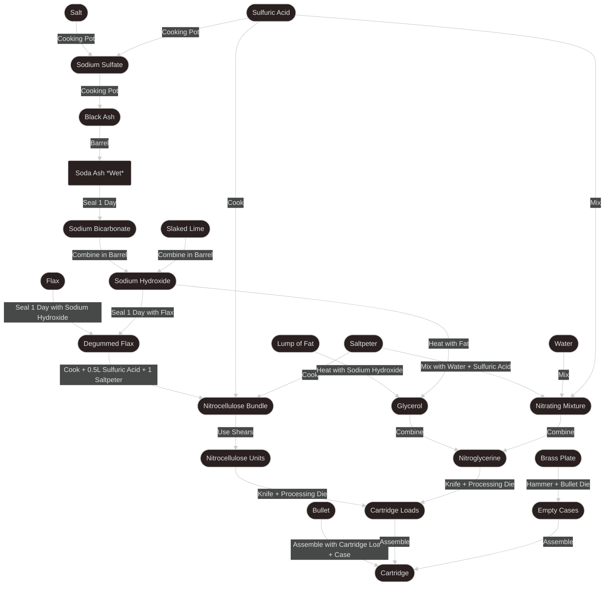

# Enhanced Firearms
A mod for the game Vintage Story.

```mermaid
---
config:
  theme: neo-dark
---
flowchart TD
salt(["Salt"]) -- Cooking Pot --> sodiumSulfate(["Sodium Sulfate"])
sulfuric(["Sulfuric Acid"]) -- Cooking Pot --> sodiumSulfate
sodiumSulfate -- Cooking Pot --> blackAsh(["Black Ash"])
blackAsh -- Barrel --> sodaAshWet("Soda Ash *Wet*")
sodaAshWet -- Seal 1 Day --> sodiumBicarb(["Sodium Bicarbonate"])
sodiumBicarb -- Combine in Barrel --> sodiumHydroxide(["Sodium Hydroxide"])
slakedLime(["Slaked Lime"]) -- Combine in Barrel --> sodiumHydroxide
flax(["Flax"]) -- Seal 1 Day with Sodium Hydroxide --> degummedFlax(["Degummed Flax"])
sodiumHydroxide -- Seal 1 Day with Flax --> degummedFlax
degummedFlax -- "Cook + 0.5L Sulfuric Acid + 1 Saltpeter" --> nitroBundle(["Nitrocellulose Bundle"])
sulfuric -- Cook --> nitroBundle
saltpeter(["Saltpeter"]) -- Cook --> nitroBundle
nitroBundle -- Use Shears --> nitroUnits(["Nitrocellulose Units"])
fat(["Lump of Fat"]) -- Heat with Sodium Hydroxide --> glycerol(["Glycerol"])
sodiumHydroxide -- Heat with Fat --> glycerol
saltpeter -- Mix with Water + Sulfuric Acid --> nitratingMix(["Nitrating Mixture"])
water(["Water"]) -- Mix --> nitratingMix
sulfuric -- Mix --> nitratingMix
glycerol -- Combine --> nitroglycerine(["Nitroglycerine"])
nitratingMix -- Combine --> nitroglycerine
nitroUnits -- Knife + Processing Die --> cartridgeLoad(["Cartridge Loads"])
nitroglycerine -- Knife + Processing Die --> cartridgeLoad
brassPlate(["Brass Plate"]) -- Hammer + Bullet Die --> emptyCases(["Empty Cases"])
bullet(["Bullet"]) -- Assemble with Cartridge Load + Case --> cartridge(["Cartridge"])
cartridgeLoad -- Assemble --> cartridge
emptyCases -- Assemble --> cartridge
```
